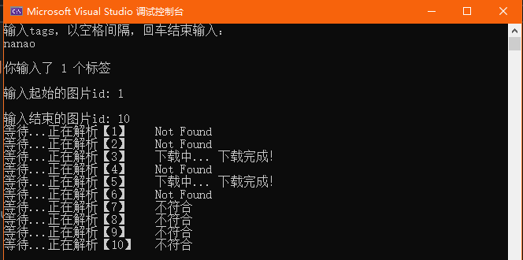

# 简介

C++ yande.re 下载器

输入tags，界定图片ID的范围，然后在yande.re中爬取下载符合输入的tags的图片到程序目录。

# 安装与编译

只使用了curl库，准备一份curl，修改YandereCrawler.h中的#include，然后用你喜欢的方式去编译。

当然，使用vcpkg安装curl更加方便。

# 为什么不多线程？甚至要等待？

了解yande.re的人应该清楚，这么一个用爱发电的网站已经被很多qq机器人或者其他爬虫每天狂下。

我更建议同时打开1-2个实例，下载不同的ID段，然后去做别的事情。

# 为什么是C++？

曾经有个“人”和我讨论qq机器人，对我说道“C++很快，但是功能呢？你的C++什么都做不出来”，我本想批评其无知，但我清楚C++的编写效率确实不尽人意。

因而我正像许多和我一样热爱这个工具，热爱用这个工具干任何事情的人一样，尝试了本来应该属于Python的领域，即使两者的速度不相上下。