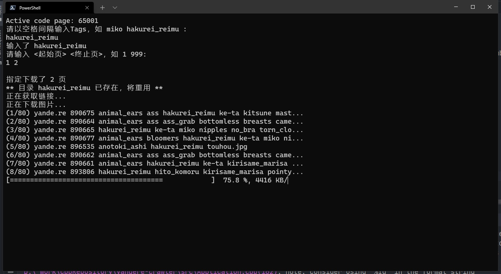

# 简介

C++ yande.re 下载器

输入tags，界定页的范围，然后在yande.re中下载符合输入的tags的图片。

# 安装与编译

依赖curl、spdlog、nlohmann-json，推荐使用vcpkg安装。

# 为什么是C++？

我只会这个。

# 关于滥用

网站管理员的行径让我发自内心地建议你下爆。

同时推荐Danbooru，虽然免费有1000页的查看限制，但管理员是好东西所以不像前者那样缺图。（把正常的图打回不就缺了嘛）